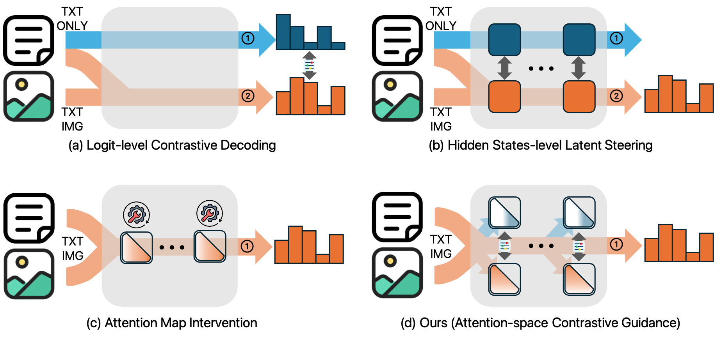

<div align="center">

# [CVPR 2026 Findings] Attention-Space Contrastive Guidance for Efficient Hallucination Mitigation in LVLMs

### Training-free, single-pass visual grounding for large vision-language models

[](https://openaccess.thecvf.com/content/CVPR2026F/html/Jo_Attention-Space_Contrastive_Guidance_for_Efficient_Hallucination_Mitigation_in_LVLMs_CVPRF_2026_paper.html)
[](https://arxiv.org/abs/2601.13707)
[](LICENSE)

</div>

Large vision-language models (LVLMs), a prominent class of multimodal large
language models (MLLMs), often fall back on language priors when visual evidence
is weak, producing fluent but ungrounded descriptions. **Attention-Space
Contrastive Guidance (ACG)** counteracts this behavior inside self-attention. It
constructs vision-language and language-only attention paths in a single model
forward pass, then amplifies the visual contribution after removing components
aligned with the language-only path.

ACG is training-free, requires no auxiliary model, and adds no second model
forward pass. This repository provides the official LLaVA-NeXT
(LLaVA v1.6) 7B and 13B implementation used in the final paper experiments.

<p align="center">
  
</p>

<p align="center">
  <em>Overview of inference-time hallucination mitigation and the proposed ACG framework.</em>
</p>

## The idea

For the current decoding query, ACG computes the standard vision-language
attention output $o_{\mathrm{VL}}$ and an image-masked approximation
$o_{\mathrm{L}}$. Their difference isolates the contribution of visual tokens:

```math
\Delta o = o_{\mathrm{VL}} - o_{\mathrm{L}}.
```

Because the two paths are computed inside one attention layer, the approximation
can contain a component aligned with the language-only output. ACG removes that
component and applies the remaining direction as guidance:

```math
\Delta o_{\perp}
= \Delta o
- \operatorname{proj}_{o_{\mathrm{L}}}(\Delta o),
\qquad
o_{\mathrm{ACG}}
= o_{\mathrm{VL}} + \gamma \Delta o_{\perp}.
```

Only the current query's access to image-token keys is masked. All parameters
remain frozen.

### Why attention-space guidance

- **Single-pass inference.** Both paths are formed within self-attention without
  running the LVLM twice.
- **Training-free intervention.** ACG modifies attention computation at decoding
  time and does not require fine-tuning or additional data.
- **Orthogonalized correction.** Guidance emphasizes visual evidence while
  suppressing approximation bias aligned with the language-only path.
- **Minimal integration surface.** The reference implementation patches eager
  Llama attention and can be enabled on any contiguous decoder-layer range.

## Main results

### CHAIR

MS COCO, fixed 500-image subset. Lower CHAIR scores indicate fewer hallucinated
objects; higher F1 indicates better object coverage and precision.

| Model | Method | CHAIRs ↓ | CHAIRi ↓ | Recall ↑ | Precision ↑ | F1 ↑ |
|---|---|---:|---:|---:|---:|---:|
| LLaVA-NeXT 7B | Vanilla | 31.2 | 8.1 | 63.2 | 83.8 | 72.1 |
| LLaVA-NeXT 7B | **ACG** | **25.2** | **5.4** | **64.5** | **86.4** | **73.9** |
| LLaVA-NeXT 13B | Vanilla | 33.8 | 8.3 | 62.9 | 82.9 | 71.5 |
| LLaVA-NeXT 13B | **ACG** | **31.0** | **5.5** | **67.3** | **84.4** | **74.9** |

### POPE

Accuracy and F1 on the random, popular, and adversarial polling splits:

| Model | Method | Random Acc. / F1 ↑ | Popular Acc. / F1 ↑ | Adversarial Acc. / F1 ↑ |
|---|---|---:|---:|---:|
| LLaVA-NeXT 7B | Vanilla | 86.67 / 84.92 | 85.53 / 83.84 | 82.77 / 81.33 |
| LLaVA-NeXT 7B | **ACG** | **88.07 / 86.83** | **86.30 / 85.16** | **82.93 / 82.16** |
| LLaVA-NeXT 13B | Vanilla | **87.97** / 86.77 | 86.43 / 85.34 | 84.27 / 83.39 |
| LLaVA-NeXT 13B | **ACG** | **87.97 / 86.79** | **86.53 / 85.47** | **84.47 / 83.60** |

The cleaned release was checked against the final paper runs. It
reproduces all 2,000 CHAIR captions and 36,000 POPE answers exactly for vanilla
and ACG across both model sizes, apart from output-path metadata and JSON
whitespace.

## Supported models

| CLI name | Hugging Face checkpoint | Decoder layers |
|---|---|---:|
| `7b` | `liuhaotian/llava-v1.6-vicuna-7b` | 32 |
| `13b` | `liuhaotian/llava-v1.6-vicuna-13b` | 40 |

The reference implementation targets eager Llama attention with
`transformers==4.37.2`. Flash Attention, grouped-query attention, and
`pretraining_tp != 1` are outside the scope of this initial release.

## Installation

Create a Python 3.10 environment, install a compatible LLaVA checkout, and then
install ACG:

```bash
conda create -n acg python=3.10 -y
conda activate acg

git clone https://github.com/haotian-liu/LLaVA.git third_party/LLaVA
pip install -e third_party/LLaVA
pip install -e ".[test]"
```

Confirm that the final Transformers version is the tested version:

```bash
python -c "import transformers; print(transformers.__version__)"
# 4.37.2
```

Model weights are downloaded by LLaVA from Hugging Face. Follow the upstream
LLaVA instructions if CUDA or PyTorch requires a platform-specific installation.

## Implementation

The implementation is intentionally small and centered on
[`acg/attention.py`](acg/attention.py):

1. `apply_acg` locates the Llama decoder layers and replaces each selected
   self-attention `forward` method while retaining the original method.
2. `_acg_attention_forward` computes the standard query, key, and value states,
   including rotary embeddings and KV-cache updates.
3. It evaluates the normal vision-language attention path, then clones its
   attention logits and masks the image-token keys for the current decoding
   query to obtain the language-only approximation.
4. `_orthogonalized_guidance` removes the component of their difference that is
   aligned with the language-only output and adds the remaining direction with
   strength `gamma`.
5. The guided attention output passes through the original output projection.
   `remove_acg` can restore every patched layer.

ACG therefore reuses the same Q/K/V states and KV cache. It adds a second
attention softmax and value aggregation inside each selected layer, but does not
run the vision encoder or language model a second time.

The intervention can also be applied directly:

```python
from acg import apply_acg, remove_acg

apply_acg(
    model,
    image_start=image_start,
    image_end=image_end,
    gamma=2.0,
    start_layer=0,
    end_layer=None,  # all decoder layers
)

# model.generate(...)
remove_acg(model)
```

## Evaluation and usage

We follow the official [CHAIR](https://github.com/LisaAnne/Hallucination) and
[POPE](https://github.com/RUCAIBox/POPE) protocols. Please use those repositories
for benchmark data, annotations, and evaluator setup. The fixed 500-image COCO
subset used for CHAIR is provided in
[`data/chair_image_ids.txt`](data/chair_image_ids.txt).

Generate CHAIR captions with ACG:

```bash
python eval/chair_generate.py \
  --model-size 7b \
  --image-folder /path/to/coco/val2014 \
  --gamma 2 \
  --output outputs/llava_next_7b_acg.jsonl
```

Generate and score one POPE split:

```bash
python eval/pope_generate.py \
  --model-size 7b \
  --question-file /path/to/coco_pope_chat_random.json \
  --image-folder /path/to/coco/images \
  --gamma 2 \
  --output outputs/pope_7b_random_acg.jsonl

python eval/pope_score.py \
  --input outputs/pope_7b_random_acg.jsonl \
  --output outputs/pope_7b_random_acg_metrics.json
```

Use `--gamma 0` for vanilla LLaVA-NeXT and `--gamma 2` for ACG. Change
`--model-size` to `13b` for the larger checkpoint. To generate all four CHAIR
caption files in sequence, run:

```bash
bash scripts/reproduce_table4.sh /path/to/coco/val2014
```

## Citation

```bibtex
@InProceedings{Jo_2026_CVPR,
  author    = {Jo, Yujin and Bae, Sangyoon and Kim, Taesup},
  title     = {Attention-Space Contrastive Guidance for Efficient Hallucination Mitigation in LVLMs},
  booktitle = {Proceedings of the IEEE/CVF Conference on Computer Vision and Pattern Recognition (CVPR) Findings},
  month     = {June},
  year      = {2026},
  pages     = {9706--9715}
}
```

## Acknowledgements

The initial ACG experimental codebase was developed on top of
[PAI](https://github.com/LALBJ/PAI). This public release distills ACG into a
focused, standalone implementation for the final LLaVA-NeXT experiments.

We also consulted the official implementations of
[VCD](https://github.com/DAMO-NLP-SG/VCD) and
[VISTA](https://github.com/LzVv123456/VISTA) while implementing and
cross-checking hallucination-mitigation baselines.

This release builds on [LLaVA-NeXT](https://github.com/LLaVA-VL/LLaVA-NeXT)
and uses the [CHAIR](https://github.com/LisaAnne/Hallucination) and
[POPE](https://github.com/RUCAIBox/POPE) evaluation protocols. We thank all
authors for making their code, models, and benchmarks available. See
[Third-party software](THIRD_PARTY.md) for dependency and licensing notes.

## License

Released under the [MIT License](LICENSE). LLaVA, model weights, MS COCO, and
evaluation dependencies retain their original licenses and terms.
